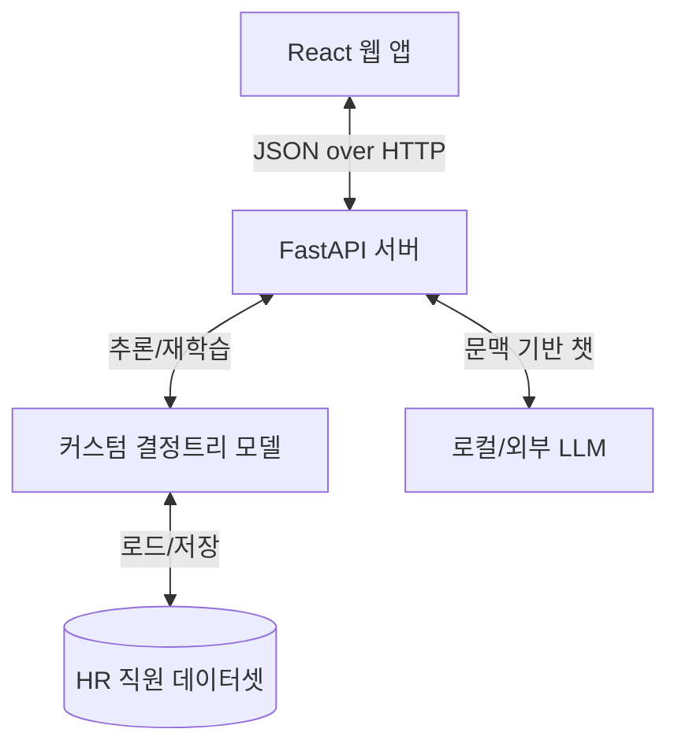

# 구현 계획 - 직원 이직 예측기 및 AX 어드바이저

이 문서는 직원 이직 예측기(Employee Attrition Predictor)와 AX 어드바이저 웹 애플리케이션의 아키텍처와 단계별 구현 계획을 설명합니다.

---

## 제안 시스템 아키텍처

애플리케이션은 클라이언트-서버 분리 구조로 설계합니다:
1. **백엔드 (Python + FastAPI)**: 머신러닝 추론, 모델 재학습, 합성 데이터 생성, LLM 오케스트레이션(예: OpenAI ChatGPT API 통합)을 담당합니다.
2. **프론트엔드 (Vite + React + 순수 CSS)**: 고급스러운 다크 테마 UI(글래스모픽 카드, 커스텀 애니메이션, 대화형 데이터 시각화, 임베디드 챗봇)를 제공합니다.



---

## 사용자 검토 필요 항목

> [!IMPORTANT]
> - **OpenAI API 키**: ChatGPT 기반 AI 컨설턴트 기능을 사용하려면 UI에서 OpenAI API 키를 입력할 수 있습니다. 키가 제공되지 않으면 백엔드는 규칙 기반의 고품질 모의 응답 모드(로컬 어드바이저 템플릿)를 사용하여 기본 기능이 작동하도록 합니다.
> - **스타일링 선택**: Tailwind 대신 CSS 변수와 순수 CSS(또는 작은 유틸리티)를 사용하여 고급스러운 다크모드 디자인(그라디언트, 글래스모픽)을 적용합니다.

---

## 미해결(질문)

- 특정 HR 데이터셋을 사용하시겠습니까, 아니면 IBM HR Analytics Employee Attrition 스키마를 기반으로 약 500–1000건 수준의 고품질 합성 데이터를 생성할까요? (권장: 합성 데이터 생성)

---

## 제안된 변경사항

### 백엔드 구성 요소

#### [새로 추가] `backend/requirements.txt`
필요 패키지 예: `fastapi`, `uvicorn`, `pandas`, `numpy`, `python-dotenv`, `openai`(선택), 기타

#### [새로 추가] `backend/app/data/generate_dataset.py`
합성 HR 데이터(OverTime, JobSatisfaction, EnvironmentSatisfaction, MonthlyIncome, WorkLifeBalance, YearsAtCompany 등)를 생성합니다.

#### [새로 추가] `backend/app/model.py`
- 모델 학습(커스텀 결정트리), 성능 지표(정확도, 정밀도, 재현율, F1, AUC 근사) 계산
- 개별 직원의 이직 확률 예측 및 기여 요인 추출

#### [새로 추가] `backend/app/llm.py`
OpenAI Chat Completion을 통합하거나, API 키가 없을 경우 사용할 로컬 규칙 기반 어드바이저(문맥 기반 응답 템플릿)를 제공합니다.

#### [새로 추가] `backend/app/main.py`
FastAPI 라우터와 엔드포인트:
- `GET /api/dashboard` : 요약 통계, 부서별 위험 수준, 전역 특성 중요도
- `GET /api/employees` : 직원 목록(검색/필터링) 및 리스크 점수
- `GET /api/employees/{id}` : 직원 상세 데이터 및 리스크 분석
- `POST /api/chat` : 직원 문맥 기반 채팅 어드바이저
- `GET /api/model` : 모델 상태 및 지표
- `POST /api/model/retrain` : CSV 업로드로 모델 재학습

---

### 프론트엔드 구성 요소

#### [새로 추가] `frontend/package.json`
Vite + React 기본 의존성(아이콘, 차트 라이브러리 등)

#### [새로 추가] `frontend/vite.config.js`
개발 중 FastAPI 백엔드(`http://localhost:8000`)로 프록시 설정 포함

#### [새로 추가] `frontend/index.html`
기본 HTML 템플릿과 프리미엄 폰트 로딩 설정

#### [새로 추가] `frontend/src/index.css`
다크모드 색상 변수, 글래스모픽 카드, 스크롤바, 전환 효과 등 디자인 시스템 핵심

#### [새로 추가] `frontend/src/App.jsx`
사이드바, 헤더, 주요 뷰(Dashboard, Employee Directory, Model Training 등) 전환을 담당하는 셸

#### [새로 추가] `frontend/src/components/Dashboard.jsx`
총 리스크, 중요 인력 수, 특성 중요도, 부서별 차트 등을 보여주는 랜딩 페이지

#### [새로 추가] `frontend/src/components/EmployeeList.jsx`
검색 가능한 직원 디렉터리(리스크 색상 표시, 필터 버튼 포함)

#### [새로 추가] `frontend/src/components/EmployeeDetail.jsx`
직원별 상세 프로파일(기여 요인, 성과 점수, AI 상담 호출 버튼)

#### [새로 추가] `frontend/src/components/Chatbot.jsx`
문맥을 받아 채팅 기록을 유지하고 스트리밍 추천을 표시하는 대화형 인터페이스

#### [새로 추가] `frontend/src/components/ModelManagement.jsx`
모델 지표, ROC(근사) 시각화 및 CSV 드래그앤드롭 업로더

---

## 검증 계획

### 자동화 테스트(권장)
- 백엔드 엔드포인트 테스트 예시:
```powershell
python -m pytest backend/tests/
```
- 프론트엔드 빌드 확인:
```powershell
npm run build
```

### 수동 확인 절차
1. FastAPI 서버 시작:
```powershell
uvicorn app.main:app --reload
```
서버가 포트 8000에서 실행되는지 확인
2. Vite 개발 서버 시작:
```powershell
npm run dev
```
UI가 포트 5173에서 정상 렌더링 되는지 확인
3. 이직 가능성이 높은 직원(예: 야근 + 낮은 직무 만족도) 예측 결과 확인
4. 특정 직원의 AI 상담 사이드바 열기 후 "이 직원에게 유지 조치 3가지를 제안해줘"와 같은 질의로 챗봇 응답 확인
5. UI에서 CSV 업로드로 모델 재학습 후 지표 갱신 확인


## 현재까지 진행 상황

- **백엔드**:
  - `backend/app/main.py`에 핵심 FastAPI 엔드포인트 구현 완료.
  - `backend/app/model.py`에 `CustomDecisionTree`와 `AttritionModel` 래퍼 구현: 학습, 평가, 지표 저장, `predict_risk()` 제공.
  - `backend/app/llm.py`에 고품질 로컬 어드바이저 템플릿 구현(문맥 기반 권장안).
  - 데이터 생성기 및 샘플 데이터가 `backend/app/data/`에 존재함(`generate_dataset.py`, `employee_attrition.csv`). 학습된 모델 아티팩트 `attrition_model.json` 저장됨.

- **프론트엔드**:
  - Vite + React 스캐폴드 및 기본 파일 존재 (`package.json`, `vite.config.js`, `index.html`).
  - 주요 컴포넌트가 `frontend/src/components`에 구현되어 있음: `Chatbot.jsx`, `Dashboard.jsx`, `EmployeeList.jsx`, `EmployeeDetail.jsx`, `ModelManagement.jsx`.

- **디스크에 저장된 항목**: `backend/app/data/employee_attrition.csv`, `backend/app/data/attrition_model.json` 및 백엔드·프론트엔드 소스 파일들.

## 단기 우선 작업

1. 프론트엔드 컴포넌트를 백엔드 API에 연결(프록시 설정 및 엔드포인트 검증)
2. 백엔드 엔드포인트에 대한 간단한 통합 테스트 추가
3. `Chatbot.jsx`, `EmployeeDetail.jsx`에서 `risk_analysis` 표시 및 스트리밍 응답 UX 개선
4. 로컬 실행 방법(백엔드/프론트 명령 및 환경 변수)을 요약한 README 섹션 추가

## 메모

- 원하시면 별도의 간단한 `progress_log.md`(타임스탬프 및 변경 사항)를 생성해 드릴 수 있습니다.

